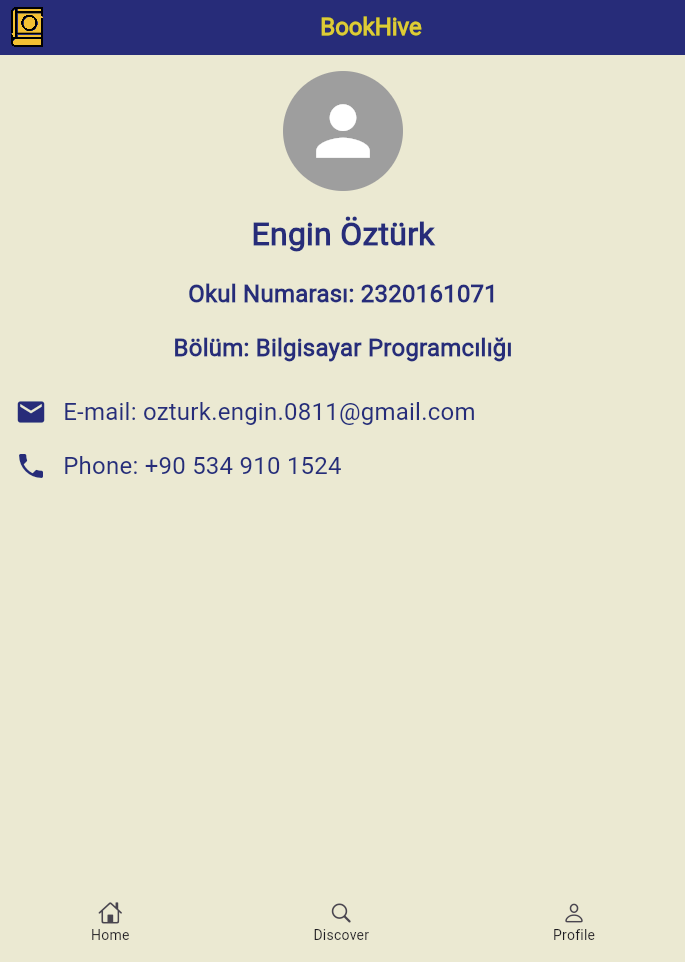

# BookHive


## Proje Hakkında

[Kitapseverlerin web üzerinden yeni kitap bulabilecekleri, kendi kütüphanelerine ekleyebilecekleri, önerilerini paylaşabileceği, kitap kulüplerine katılabileceği ve okuma hedeflerini takip edebileceği sosyal bir platform.]


## Ekibimiz

- **Danışman:**

    Keyvan Arasteh [GitHub](https://github.com/keyvanarasteh)


- **Takım Üyeleri:**

    Engin Öztürk [GitHub](https://github.com/EnginOzturk-7)

  

## Özellikler

- [Kitap bilgileri ]

- [Arama çubuğu ]

- [Profil ]

  

## Kullanılan Teknolojiler

- Flutter

- Dart

- [VS Code]

  

## Başlangıç

  

### Gereksinimler

- Flutter SDK (sürüm 3.24.5)

- Dart SDK (sürüm 3.5.4)

  

### Kurulum Adımları

1. Projeyi bilgisayarınıza indirin:

```bash

git  clone [https://github.com/EnginOzturk-7/BookHive-flutter]

```

  

2. Proje klasörüne gidin:

```bash

cd [BookHive-flutter]

```

  

3. Gerekli paketleri yükleyin:

```bash

flutter  pub  get

```

  

4. Uygulamayı başlatın:

```bash

flutter  run

```

  

## Proje Yapısı

```

lib/

├── modeller/ # Veri modelleri

├── ekranlar/ # Uygulama ekranları

├── widgets/ # Tekrar kullanılabilir arayüz öğeleri

├── servisler/ # API servisleri

└── yardımcılar/ # Yardımcı fonksiyonlar

```

  

## Ekran Görüntüleri

 





## Demo Videosu

<video controls src="Demo_Video.mp4" title="Title"></video>


## Projeye Katkı Sağlama

1. Projeyi forklayın

2. Yeni bir dal oluşturun (`git checkout -b ozellik/YeniOzellik`)

3. Değişikliklerinizi kaydedin (`git commit -m 'Yeni özellik eklendi'`)

4. Dalınıza gönderin (`git push origin ozellik/YeniOzellik`)

5. Pull Request oluşturun

  

## Lisans

[MIT Licence] kapsamında lisanslanmıştır. Daha fazla bilgi için `LICENSE` dosyasını inceleyebilirsiniz.

  

## İletişim

- Proje Bağlantısı: [https://github.com/EnginOzturk-7/BookHive-flutter]

- İstinye Üniversitesi: [https://www.istinye.edu.tr/](https://www.istinye.edu.tr/)

  

## Teşekkürler

- Danışmanımız Sayın Keyvan Arasteh'e ve İstinye Üniversitesi'ne destekleri için teşekkür ederiz


